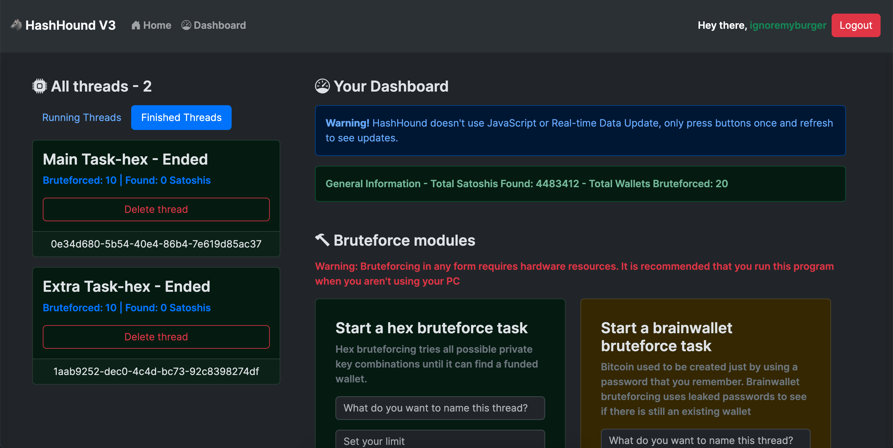

# **HashHound: ** Fast, efficient and secure Bitcoin wallet bruteforcer

<b>HashHound version 3. Improved UI and performance</b> 
<i>Fortune favors the brave</i>

### **Introduction**
We love Cryptocurrencies, we love treasure hunting, why not make a tool for the adventurous

### **How can I get it?**
Contact <b>@gerryrylan89</b> on Telegram to buy. We only accept cryptocurrencies.

There are a few options for our customers:

- Buy our latest version for <b>30$</b> (one-time pay). 

- Buy our latest version but with customer support and 30 days of warranty for <b>50$</b> (one-time pay)

- VIP package for <b>450$</b> (one-time pay): Get the latest version with priority support. You will be notified if there is a new update for HashHound. VIP users will get the next 3 versions of HashHound for free.

<b><i>HashHound doesn't process refunds.</i></b>

### **I don't have enough money to purchase HashHound**
Don't worry, our version 2 is still available for purchase for only 20$. If that is still outside your budget, there is nothing we can do for you.

### **How does it work?**
HashHound utilizes multiple bruteforcing modules and attack vectors to crack existing Bitcoin wallets. From Hex private key bruteforcing to Seed Phrase bruteforcing, we got you covered.

<b><i>HashHound comes in 3 versions:</i></b>
- <b>Version 1 (Nyx) - deprecated</b>: A basic version of HashHound. Although simple but it gets the job done. Only has 1 hex bruteforce module.

- <b>Version 2 (Hera)</b>: Significant improvement from the prior version of HashHound, better UI and stability. Better threading management.

- <b>Version 3 (Athena)</b>: Better security for HashHound customers, authentication with a license key, username and password. HashHound code base is now obfuscated. Seed wallet bruteforcing is introduced only to VIP users.

### **How long does it take until I can find a funded Bitcoin wallet?**
HashHound and its developers does not guarantee success while using this tool. While this is based purely on luck, why not giving it a shot?

